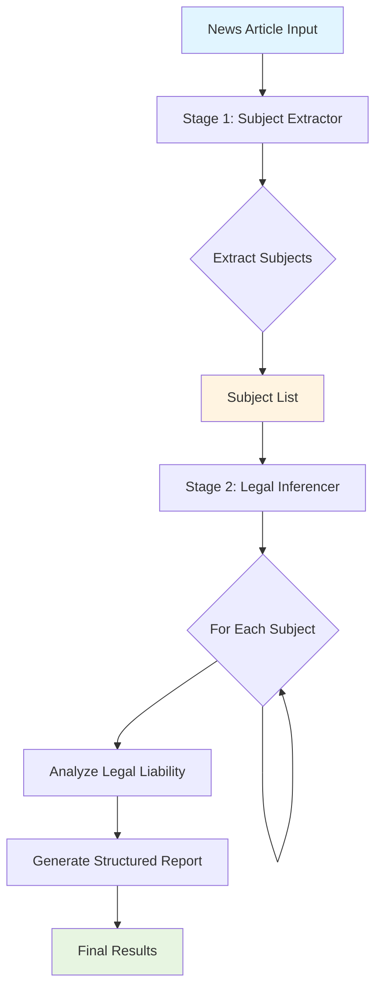
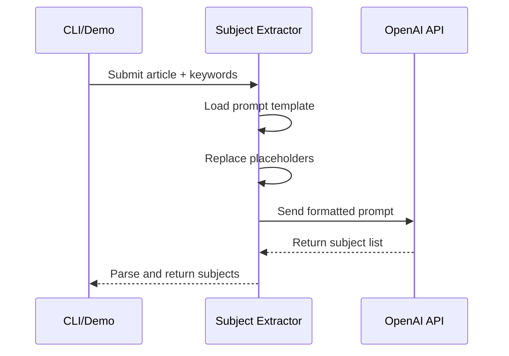
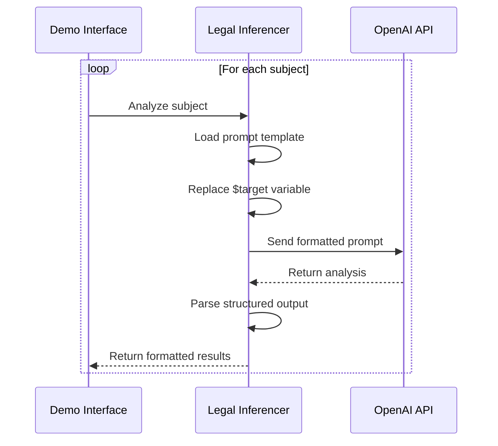
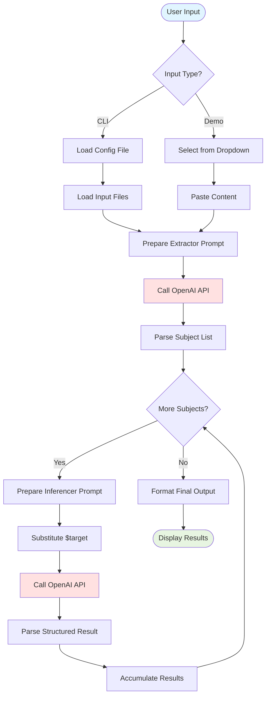

# Architecture Guide

## System Overview

The News Inferencer is a two-stage AI pipeline that analyzes news articles for legal liability detection.



## Core Components

### 1. Subject Extractor

**Purpose**: Identify all relevant subjects (people, organizations) mentioned in the news article.

**Input**:
- News content
- Crime keywords list
- Judge keywords list

**Output**:
- Comma-separated list of identified subjects

**Process Flow**:


### 2. Legal Liability Inferencer

**Purpose**: For each identified subject, determine their legal status and liabilities.

**Input**:
-  Subject name
- News content
- Crime keywords
- Legal proceeding keywords

**Output** (structured):
- Subject name (主體)
- Has legal liability (是否有嫌疑): Yes/No
- Related crimes (刑責)
- Legal proceeding status (刑責進度)
- Event summary (事件摘要)

**Process Flow**:


### 3. Prompt Configuration System

**Purpose**: Manage multiple prompt versions and strategies.

**Configuration Structure**:
```json
{
  "name": "Prompt Version Name",
  "files": {
    "system": "system_prompt.txt",
    "user": "user_prompt.txt"
  },
  "inputs": ["variable1", "variable2"]
}
```

**Variable Replacement**:
- Prompts use `$variable_name` syntax
- Variables are replaced with actual content at runtime
- Common variables:
  - `$crime_keywords` - Crime-related terms
  - `$judge_keywords` - Legal proceeding terms
  - `$news_content` - Article text
  - `$target` - Subject being analyzed

### 4. Configuration-Based Crawler

**Purpose**: Extract news content from various websites using XPath.

**Design Pattern**:
```python
{
  "website_domain": {
    "title": "xpath_to_title",
    "content": "xpath_to_content",
    "reporter": "xpath_to_reporter",
    "extra_*": "xpath_to_additional_fields"
  }
}
```

## Data Flow

### Complete Analysis Pipeline



## Module Organization

### Current Structure

```
news_inferencer/
├── prompt.py          # CLI tool + OpenAI client
├── demo.py            # Gradio interface
├── main.py            # Environment loader
├── concept.py         # Crawler example
└── kgai/             # Future library module
    └── __init__.py
```

### Key Functions

#### `prompt.py`

- **`submit(system_content, user_content)`**
  - Sends prompts to OpenAI API
  - Returns raw API response
  - Uses temperature=0.0 for deterministic output

- **`prompt_conversion(prompt, keys, inputs)`**
  - Replaces `$variables` in prompts
  - Loads content from files
  - Returns formatted prompt string

#### `demo.py`

- **`analysis(extractor_conf, inferencer_conf, ...)`**
  - Main analysis pipeline
  - Orchestrates extraction and inference
  - Returns formatted markdown results

- **`complete(conf_file, crime_keywords, ...)`**
  - Loads configuration
  - Performs variable substitution
  - Returns prepared configuration

## Environment Configuration

Environment variables loaded via `python-dotenv`:

| Variable | Required | Purpose |
|----------|----------|---------|
| `OPENAI_API_KEY` | ✅ | Authentication for OpenAI API |
| `OPENAI_BASE_URL` | ❌ | Custom API endpoint |
| `OPENAI_MODEL` | ❌ | Override default model |
| `OPENAI_TEMPERATURE` | ❌ | Control randomness |
| `OPENAI_MAX_TOKENS` | ❌ | Limit response length |

## API Integration

### OpenAI API Usage

**Current Implementation** (v0.27.8 - Legacy):
```python
import openai
openai.api_key = os.getenv('OPENAI_API_KEY')

response = openai.ChatCompletion.create(
    model="gpt-3.5-turbo",
    messages=[
        {"role": "system", "content": system_prompt},
        {"role": "user", "content": user_prompt}
    ],
    temperature=0.0
)
```

**Planned Update** (v1.x - Modern):
```python
from openai import OpenAI

client = OpenAI(
    api_key=os.getenv('OPENAI_API_KEY'),
    base_url=os.getenv('OPENAI_BASE_URL')  # Optional
)

response = client.chat.completions.create(
    model=os.getenv('OPENAI_MODEL', 'gpt-3.5-turbo'),
    messages=[...],
    temperature=float(os.getenv('OPENAI_TEMPERATURE', '0.0'))
)
```

## Error Handling Strategy

> **Note**: Current implementation has minimal error handling. This is address in the modernization phase.

**Recommended Error Handling**:
1. **API Rate Limits**: Implement exponential backoff
2. **Network Errors**: Retry with timeout
3. **Invalid Responses**: Validate and log errors
4. **File Not Found**: Clear error messages
5. **Configuration Errors**: Schema validation

## Performance Considerations

### Current Bottlenecks

1. **Sequential API Calls**: Each subject analyzed one-by-one
2. **No Caching**: Repeated analyses make duplicate API calls
3. **Synchronous Execution**: No async/await support

### Optimization Opportunities

1. **Parallel Processing**: Use `asyncio` for concurrent subject analysis
2. **Response Caching**: Cache results for identical inputs
3. **Batch Processing**: Group similar subjects
4. **Rate Limiting**: Respect API quotas efficiently

## Security Considerations

1. **API Key Protection**:
   - Store in `.env` (never commit)
   - Use environment variables
   - Validate before use

2. **Input Validation**:
   - Sanitize user inputs
   - Validate file paths
   - Check configuration schemas

3. **Output Sanitization**:
   - Escape HTML in Gradio outputs
   - Validate AI responses
   - Log anomalies

## Extensibility

The system is designed for extension:

1. **New Prompt Strategies**: Add JSON configs in `prompts/`
2. **Custom Keywords**: Create new keyword files in `samples/`
3. **Alternative LLMs**: Change API endpoint via `OPENAI_BASE_URL`
4. **Additional Extractors**: Implement new analysis stages

---

**Related Documentation**:
- [Configuration Guide](CONFIGURATION.md)
- [Prompt Engineering](PROMPT_ENGINEERING.md)
- [API Reference](API_REFERENCE.md)
